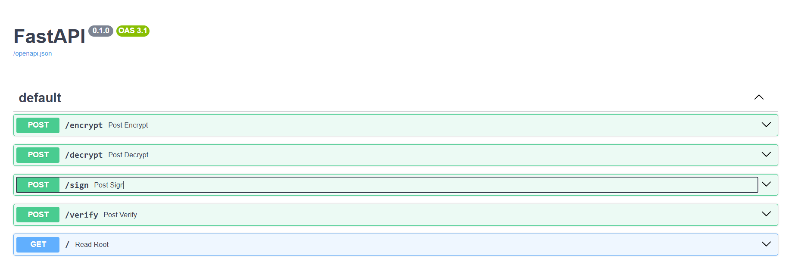

# Riot-assessment

# Running locally

## 1) Create an virtual environment
```sh
python -m venv env
source env/bin/activate
```
## 2) Install Dependencies
```sh
pip install -r requierements.txt
```

## 3) Run FastAPI
```sh
fastapi dev src/main.py
```

# Running Tests
```sh
pytest
```

# Docker Deployement
## Build Image
```sh
docker build -t riot-api .
```

## Run Image
```sh
docker run -p 8000:8000 -e SECRET_KEY="your_secret_key" riot-api
```

# API Documentation

Swagger is available at `localhost:8000/docs`




# Available Endpoints

Encrypts the provided JSON payload using Base64 encoding
## /encrypt
```sh
curl -X POST localhost:8000/encrypt -H "Content-Type: application/json" -d '{
  "name": "John Doe",
  "age": 30,
  "contact": {
    "email": "john@example.com",
    "phone": "123-456-7890"
  }
}'
```

Reponse:
```json
{
  "name": "Sm9obiBEb2U=",
  "age": "MzA=",
  "contact": "eyJlbWFpbCI6ImpvaG5AZXhhbXBsZS5jb20iLCJwaG9uZSI6IjEyMy00NTYtNzg5MCJ9"
}
```

## /decrypt
Decrypts the provided Base64-encoded JSON payload
```sh
curl -X POST localhost:8000/decrypt -H "Content-Type: application/json" -d '{
  "name": "Sm9obiBEb2U=",
  "age": "MzA=",
  "contact": "eyJlbWFpbCI6ImpvaG5AZXhhbXBsZS5jb20iLCJwaG9uZSI6IjEyMy00NTYtNzg5MCJ9"
}'
```

Response:
```json
{
  "name": "John Doe",
  "age": 30,
  "contact": {
    "email": "john@example.com",
    "phone": "123-456-7890"
  }
}
```

Unencrypted properties must remain unchanged:

```sh
curl -X POST localhost:8000/decrypt -H "Content-Type: application/json" -d '{
  "name": "Sm9obiBEb2U=",
  "age": "MzA=",
  "contact": "eyJlbWFpbCI6ImpvaG5AZXhhbXBsZS5jb20iLCJwaG9uZSI6IjEyMy00NTYtNzg5MCJ9",
  "birth_date": "1998-11-19"
}'
```

Response:
```json
{
  "name": "John Doe",
  "age": 30,
  "contact": {
    "email": "john@example.com",
    "phone": "123-456-7890"
  },
  "birth_date": "1998-11-19"
}
```

## /sign

Generates a signature for the provided data using HMAC

```sh
curl -X POST localhost:8000/sign -H "Content-Type: application/json" -d '{
  "message": "Hello World",
  "timestamp": 1616161616
}'
```

Response:
```
{
  "signature": "a1b2c3d4e5f6g7h8i9j0..."
}
```


## /verify

Verify the signature with the data

```sh
curl -X POST localhost:8000/verify -H "Content-Type: application/json" -d '{
  "signature": "a1b2c3d4e5f6g7h8i9j0...",
  "data": {
    "message": "Hello World",
    "timestamp": 1616161616
  }
}'
```

Output: 204 HTTP response


```sh
curl -X POST localhost:8000/encrypt -H "Content-Type: application/json" -d '{
  "signature": "a1b2c3d4e5f6g7h8i9j0...",
  "data": {
    "timestamp": 1616161616,
    "message": "Goodbye World"
  }
}'
```

Output: 400 HTTP response
